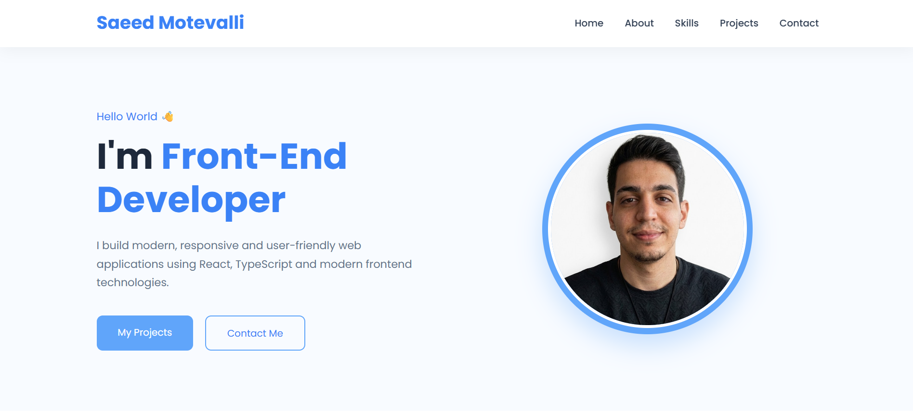

# 💼 Saeed Motevalli Portfolio

A modern and responsive personal portfolio website built to showcase my frontend development skills, projects, and technical experience.

The portfolio is designed with a clean UI, responsive layout, and focuses on presenting real-world frontend projects with live demos and source code.

---

## 🚀 Live Demo

🌐 Website:

[(saeed-motevalli-portfolio)](https://saeed-motevalli.github.io/saeed-motevalli-portfolio/)

## 📸 Preview

<p align="center">
  
</p>

# 📌 About The Project

This portfolio website was created to introduce myself as a Front-End Developer and showcase my development journey.

The main goals of this project:

- Creating a professional developer portfolio
- Building a clean and responsive user interface
- Presenting frontend projects with live demos
- Practicing modern UI structure and layout design
- Improving HTML and CSS architecture

The website is fully responsive and optimized for:

✅ Desktop  
✅ Tablet  
✅ Mobile

---

# ✨ Features

## 👨‍💻 Personal Introduction

- Hero section with developer introduction
- About me section
- Skills showcase
- Contact section with social links

---

## 🛠️ Skills Section

The portfolio highlights my frontend skills:

- HTML5
- CSS3
- JavaScript
- React
- TypeScript
- Next.js
- Tailwind CSS
- Git & GitHub

---

## 📂 Projects Showcase

The portfolio includes my main frontend projects:

### 🛒 Derafsh E-Commerce

A modern responsive e-commerce platform built with:

- React
- TypeScript
- Next.js
- Tailwind CSS

Features:

- Product pages
- Shopping cart
- User account pages
- Responsive design

GitHub:

https://github.com/Saeed-Motevalli/derafsh-ecommerce

Live Demo:

https://derafsh-ecommerce.saeed-motevalli25.workers.dev/

---

### 🌦️ Weather App

A responsive weather application built with:

- HTML
- CSS
- JavaScript

Features:

- API integration
- Dynamic weather information
- Responsive interface

GitHub:

https://github.com/Saeed-Motevalli/weather-app

Live Demo:

https://saeed-motevalli.github.io/weather-app/www/index.html

---

### ✅ Todo App

A simple and responsive task management application built with:

- HTML
- CSS
- JavaScript

Features:

- Task management
- Interactive UI
- DOM manipulation

GitHub:

https://github.com/Saeed-Motevalli/todo-app

Live Demo:

https://saeed-motevalli.github.io/todo-app/www/index.html

---

# 🛠️ Technologies Used

## Frontend

- HTML5
- CSS3
- JavaScript
- Responsive Web Design

## Tools

- Git
- GitHub
- VS Code

---

# 📱 Responsive Design

The website follows a responsive design approach.

Layouts are optimized for different screen sizes:

- Desktop navigation
- Tablet layouts
- Mobile-friendly sections
- Responsive project cards

---

# 📂 Project Structure

```
personal-portfolio
│
├── index.html
├── style.css
├── README.md
├── .gitignore
│
├── assets
│   ├── images
│   │   ├── profile.jpg
│   │   ├── derafsh.png
│   │   ├── weather.png
│   │   └── todo.png
│   │
│   └── favicon
│       └── Blue.webp
│
└── screenshots
    └── portfolio.png
```

---

# 🎯 Project Goals

This project helped me improve:

- Frontend development skills
- Responsive design techniques
- Clean UI implementation
- Project presentation for professional portfolios
- Git and GitHub workflow

---

# 👨‍💻 Author

## Saeed Motevalli

Front-End Developer

[(GitHub)](https://github.com/Saeed-Motevalli)

[(LinkedIn)](https://www.linkedin.com/in/saeed-motevalli-34bbaa436/)
